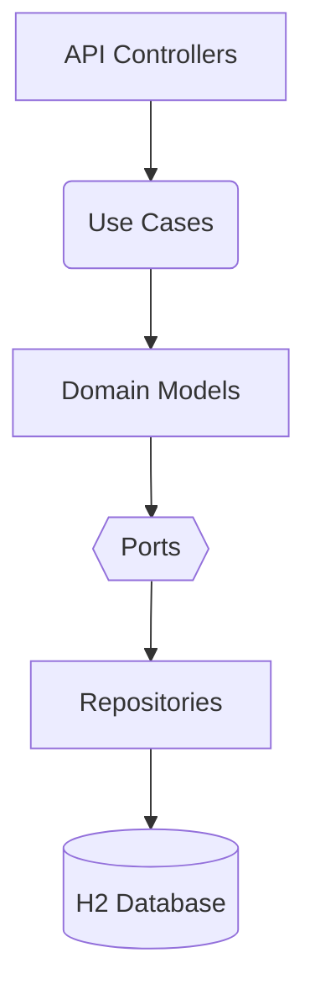

# 🏷️ PRICES  
*Hexagonal Architecture | Spring Boot | Clean Code*  

[](https://openjdk.org/projects/jdk/17/)
[](https://spring.io/projects/spring-boot)

---

## 📌 Overview  
A REST API that retrieves product pricing based on:  
- **Brand ID**  
- **Product ID**  
- **Application date/time**  

Built with **Hexagonal Architecture** for maintainability and testability.

---

## 🚀 Features  
✅ **Clean Architecture** (Domain, Application, Infrastructure layers)  
✅ **Custom error handling** with meaningful HTTP responses  
✅ **Validation** for all input parameters  
✅ **In-memory H2 database** with sample data  

---

## 🏗️ Architecture  

> ℹ️ Diagram below rendered using [Mermaid](https://mermaid.js.org/)



---

## 📖 API Documentation

You can explore the full API documentation via:

🔗 [Swagger UI](http://localhost:8080/swagger-ui.html)  
📄 [OpenAPI Spec](http://localhost:8080/v3/api-docs)  

### 🔍 Example: `GET /api/prices`

Retrieves product pricing based on brand ID, product ID, and application date.

**Query Parameters:**
- `brandId` (Long) – e.g., `1`
- `productId` (Long) – e.g., `35455`
- `applicationDate` (String - ISO) – e.g., `2020-06-14T10:00:00`

**Response:**
```json
{
  "productId": 35455,
  "brandId": 1,
  "priceList": 1,
  "startDate": "2020-06-14T00:00:00",
  "endDate": "2020-12-31T23:59:59",
  "price": 35.5,
  "currency": "EUR"
}
```


---

## 📬 Contact

**Andrius Pazukas**  
📧 andriuspazukas1981@gmail.com 

